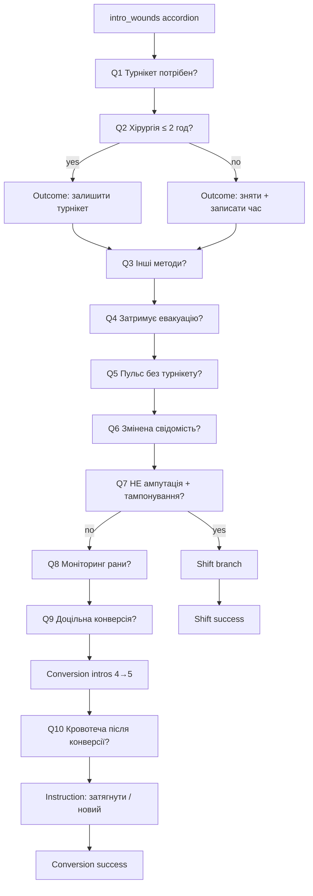

# Poll / algorithm flow — implementation plan

> **Status:** plan + definition only. Implement against [`poll-flow.definition.ts`](../apps/api/src/poll/data/poll-flow.definition.ts) in the next prompt.  
> Replaces the current placeholder English quiz in `poll-questions.data.ts`.

## Goals

1. Authenticated users run the **conversion / relocation decision algorithm** at `/flow`.
2. Every answer is **persisted**; incomplete sessions **resume** after re-login.
3. UI matches screenshots: accordion intros, compact Так/Ні (not half-screen tiles), instruction steps with **Далі** / **Назад**, branch-specific success screens.
4. Results (completed path + answers) available for the user after finish.

## Auth (done in this pass)

| Item | Behavior |
|------|----------|
| Home | `Увійти` / `Зареєструватися` or `Вийти` via `AuthNavButtons` |
| Start | Guests → `/login?redirect=/flow?resume=true`; authed → `/flow` |
| Login / Signup | Shared `AuthSubmitButton` + `GoogleAuthButton` |
| Signup | Creates user, then logs in and lands on `/` |
| Poll | JWT required; existing `start` / `resume` / `answer` endpoints stay the persistence layer |

## UI building blocks (next implement)

| Kind | Screenshot | Component (suggested) | Navigation |
|------|------------|----------------------|------------|
| `intro_accordion` | 1, 3, 4, 5 | Expandable white cards + optional body text/media; connectors optional | `StepNavActions` (Далі / Назад) |
| `yes_no` | 2 | Compact side-by-side or stacked **Так** / **Ні** using theme `secondary` (reuse kit; **no** giant half-screen cards) | Answer submits immediately or + Далі |
| `instruction` | mid-branch | Single message card(s), no yes/no | Далі (and Назад where needed) |
| `instruction_list` | shift step 2 | Accordion / list of fixed sentences | Далі |
| `outcome` | after some answers | Guidance text (may be terminal or soft-block before retry) | Далі or end |
| `success` | shift / conversion end | Success + monitoring reminder | End / home CTA |

Reuse: `StepNavButton`, `StepNavActions`, future `FlowAccordion` / `YesNoChoice`.

## Persistence model (API)

Keep session + answers; **evolve step model from linear index → node id**.

| Field | Change |
|-------|--------|
| `PollSession.currentStep` | Prefer `currentNodeId: string` (or encode node id in step metadata) |
| `PollAnswer` | Store `{ nodeId, answer: 'yes' \| 'no' \| 'ack', branch? }` |
| Resume | Load session → return payload for `currentNodeId` (question **or** intro/instruction) |
| Complete | `completed=true` when node type is `success` acknowledged |

Engine: given `nodeId` + answer → lookup edge in `POLL_FLOW` → next node (or outcome then next).

## High-level sequence

> **Clarify in next pass if needed:** whether Q2 outcomes are **hard stops** (session complete) or informational before Q3. Definition currently treats them as `outcome` then continues to Q3 — adjust edges if product wants terminal exits.

## Trunk questions (main)

| ID | Text | UI | Edges |
|----|------|-----|-------|
| `intro_wounds` | Wound assessment accordion (screenshot 1) | `intro_accordion` | → `q1` |
| `q1` | Чи потрібен турнікет? | `yes_no` | both → `q2` *(confirm if no = early exit)* |
| `q2` | Чи можлива хірургічна обробка рани протягом 2-ох годин? | `yes_no` | yes → `q2_yes_outcome`; no → `q2_no_outcome` |
| `q2_yes_outcome` | Залишаємо ефективний турнікет на місці. | `outcome` | → `q3` or **end** (TBD) |
| `q2_no_outcome` | Зніміть турнікет, запишіть час накладання в карту пораненого. | `outcome` | → `q3` or **end** (TBD) |
| `q3` | Чи можливо використовувати інші методи контролю кровотеч? | `yes_no` | both → `q4` |
| `q4` | Чи затримує евакуацію конверсія чи переміщення турнікету? | `yes_no` | both → `q5` |
| `q5` | У постраждалого присутній пульс на кінцівках без турнікету? | `yes_no` | both → `q6` |
| `q6` | У постраждалого змінений стан свідомості або постраждалий без свідомості? | `yes_no` | both → `q7` |
| `q7` | Рана постраждалого НЕ є ампутацією та підходить для тампонування? | `yes_no` | **yes → shift branch**; **no → `q8`** |

## Shift branch (Q7 = yes)

| ID | Content | UI | Edges |
|----|---------|-----|-------|
| `shift_intro` | Screenshot 3 accordion (переміщення steps) | `intro_accordion` | → `s1` |
| `s1` | Чи достатньо місця для осмисленого турнікету (5–8 см вище)? | `yes_no` | no → `s1_no_outcome`; yes → `s2` |
| `s1_no_outcome` | Затягніть попередній турнікет або накладіть новий впритул до першого. | `outcome` | → end or retry (TBD; default: continue/end soft) |
| `s2` | Two sentences (розмістіть… / повільно послабте…) | `instruction_list` | Далі → `s3` |
| `s3` | Чи відновилась кровотеча на місці поранення? | `yes_no` | no → `s3_no_outcome`; yes → `s4` |
| `s3_no_outcome` | Затягніть швидкий… дотягніть осмислений… повторіть послаблення. | `outcome` | back/`s3` or Далі (TBD) |
| `s4` | Посуньте послаблений швидкий турнікет впритул до прицільного. | `instruction` | Далі → `s5` |
| `s5` | Чи присутній пульс на кінцівці під турнікетом? | `yes_no` | no → `s5_no_outcome`; yes → `s6` |
| `s5_no_outcome` | Спробуйте дотягнути осмислений турнікет. | `outcome` | → `s6` or retry |
| `s6` | Запишіть час переміщення… задокументуйте в картці. | `instruction` | Далі → `s7_success` |
| `s7_success` | Переміщення виконано успішно! + моніторинг 5 / 15 хв | `success` | complete session |

## Conversion branch (Q7 = no)

| ID | Content | UI | Edges |
|----|---------|-----|-------|
| `q8` | Чи можливо слідкувати за раною на предмет повторної кровотечі? | `yes_no` | save → `q9` |
| `q9` | Чи доцільна конверсія з тактичних та медичних міркувань? | `yes_no` | → `conv_intro_1` *(confirm if no = skip/end)* |
| `conv_intro_1` | Screenshot 4 accordion | `intro_accordion` | Далі → `conv_intro_2` |
| `conv_intro_2` | Screenshot 5 accordion | `intro_accordion` | Далі → `q10` |
| `q10` | Чи відновилась кровотеча на місці конверсії турнікету? | `yes_no` | → `q11` |
| `q11` | Затягніть попередній турнікет або накладіть новий на шкіру 5–8 см над раною… | `instruction` | Далі → `conv_success` |
| `conv_success` | Конверсія виконана успішно! + моніторинг | `success` | complete session |

## Frontend flow sketch (`/flow`)

1. Require auth (redirect login with resume).
2. `GET /poll/resume` else `GET /poll/start` → receive `{ token, nodeId, node }`.
3. Render by `node.kind`.
4. On answer / Далі → `POST /poll/answer` with `{ token, nodeId, answer }`.
5. On `success` → show results summary (answers path) + optional `GET /poll/results/:sessionId`.
6. Назад: either local step stack for intros only, or server-supported history (phase 2).

## Implementation order (next prompt)

1. Replace `POLL_QUESTIONS` with engine driven by `POLL_FLOW` / `poll-flow.definition.ts`.
2. Migrate session to `currentNodeId`; keep resume.
3. UI kit: `YesNoChoice`, `FlowAccordion`.
4. Rebuild `Flow.tsx` + `usePoll` for node kinds.
5. i18n: move all Ukrainian strings from definition or `locales/uk`.
6. Results screen after `success`.
7. Manual test matrix: Q7 yes → full shift; Q7 no → full conversion; logout/login resume mid-tree.

## Open questions

1. Are `q2` outcomes **terminal** (stop algorithm) or informational before `q3`?
2. Exact yes/no clinical exits for `q1`, `q3`–`q6`, `q9`, `q10` (not fully specified).
3. After `s1_no` / `s3_no` / `s5_no`: hard end, loop, or continue?
4. Should Назад undo last **saved** answer or only navigate unsaved intros?

## Reference files

- Definition: `apps/api/src/poll/data/poll-flow.definition.ts`
- Current (to replace): `apps/api/src/poll/data/poll-questions.data.ts`
- UI kit nav: `apps/web/src/pages/components/ui-kit/StepNavButton`, `StepNavActions`
- Auth buttons: `AuthSubmitButton`, `GoogleAuthButton`, `AuthNavButtons`
